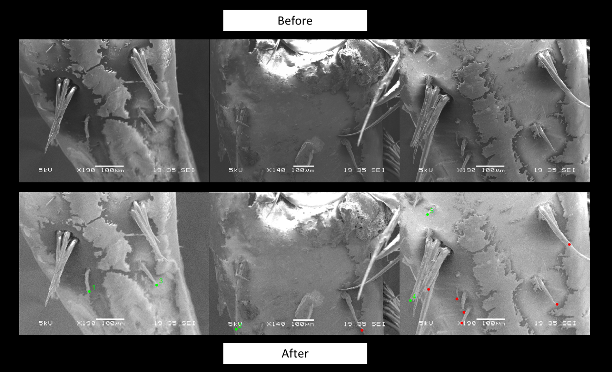

# Feature Selection

## Background
I supervise a group of students who are investigating the functional morphology of Mangrove Tree Crabs (*Aratus pisonii*) to determine how these crabs can climb trees. In our investigation we found that, like many other climbing organisms, these crabs have hair-like microstructures which are typically used to increase the frictional coefficient, allowing the organism to better adhere to a surface. As measuring the aspect ratio (length:width) of these microstructures is common in adhesion studies, we followed suite. We obtained images of the crab legs with a Scanning Electron Microscope (SEM) to provide the best contrast between the hairs and the rest of the leg. As there could be hundreds of hairs on a single leg of a crab, I told the students to randomly select a certain number of the hairs before measuring the aspect ratio in ImageJ.

## The Problem
After one week, the students came to me saying they had only measured 50 hairs and it would take them another 14 weeks to complete the measurements. After a discussion about their methods, I learned it was not measuring the hairs that was taking so much time, it was their method of randomly selecting the hairs. They would load the image into MS Paint and put a number label on all hairs that could be measured before using an online random number generator to randomly select the hairs from a number sequence. In the discussion with the students, an additional problem arose in that they did not have a record of which hairs were randomly selected.  This presents serious reproducibility concerns. It was clear that I needed to develop a tool that (1) sped up the selection process and (2) recorded which hairs were selected.

## The Solution
I developed an interactive script in RStudio which allows the students to places markers on the specific feature they wish to measure which are then either chosen or not chosen to be measured.

The script starts by asking how many features should be randomly picked.  Image names of the TIFF files are then extracted from the img_orig folder and grouped by the unique crab, side, and leg combinations from their file name. Each group could have one to five images depending on the size of the crab leg and the expression of the features of interest. The code begins to loop through each group. For every image in the group, the image is loaded and plotted before the user is requested to click on the features of interest on the plot. Once one image is marked, the next image in the group is plotted and the process repeats itself. Once all images in the group have been marked, the code randomly selects the number of features requested across all images in the group. Again, each image in the group is plotted and a point is placed at all features the user marked. The point color is red for those that were not randomly picked, with those which were picked being labeled in green and with a number. The images are then saved to the img_save folder. The code will then ask the user if they want to move onto the next group. If the user responds 'yes', the loop begins again for the next group of images. If the user responds 'no', the loop breaks after indicating the starting position to use if the user wants to pick up where they left off.

The students used this tool to run through their images and what was originally quoted at 14 weeks to complete with the old method took 2; a seven-fold reduction!

## Examples
I have provided a few example images if anyone wants to try this process out. Just download the FeatureLabeling RProject folder, open feature_select.R, select all, and run. I suggest setting the number of features requested to five if you are running this as an example. Try selecting different number of points; the script is able to handle various inputs such as if few than the requested features are present, or if no features are marked.

## More Info
If you are interested in this project learn more at https://louismpenrod.wixsite.com/home/mangrove-tree-crabs
