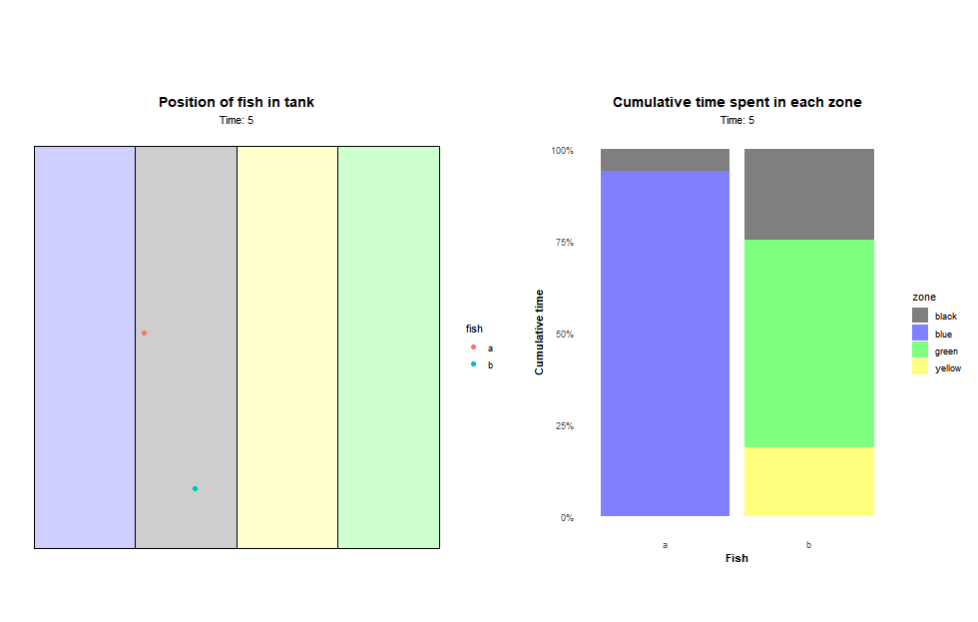

# Fish Tracking Animation

## Background
I was assisting a group of engineers at Florida Tech to develop a fish-specific trap. They had me test different methods that could passively attract the fish towards the trap. For one of these methods, they had me determine if a particular color was more appealing to the fish. We would evaluate the fish's affinity for a particular color by recording the fish movements in a tank that was divided into four colored sections. The section or 'zone' where the fish spent the most time could indicate an attraction to that color. 

I wanted to develop a method to actively show the fish's preference for color (or lack thereof) besides a boring static graph. An animation would accomplish this task.

## Example
Within the AnimationTest.R file is simplified example. The script creates two animations. The first is shows where the fish is at each time-step with the second showing the cumulative proportional time spent in each zone for each fish. The animations are then stitched together to make a single animation. Here is the result:

 

