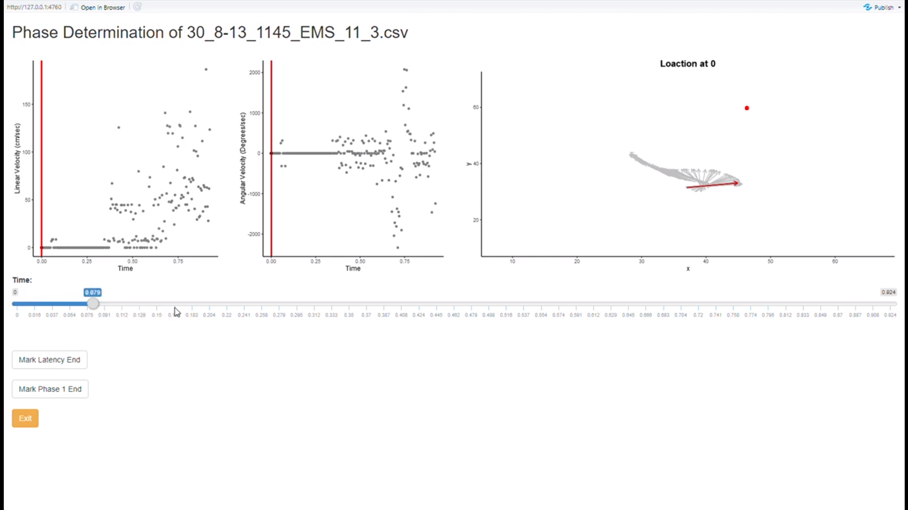

# Turning Phase

## Background
While attending an intensive summer course on fish swimming and kinematics at the Friday Harbor Marine Laboratories, some collaborators and I became interested in the escape responses of fishes and the neural pathways associated with the response. Fish have several types of kinematic responses (which can be broken down into different phases of the responces) that are used for various types of behavioral responses (Domenici and Blake, 1997). **See Figure 5 [here](http://biomimetic.pbworks.com/f/The+kinematics+and+performance+ofDomenici.pdf) for more detail.** Typically, escape responses have a short latency (the period between when a stimulus is introduced and the fish responds) and high velocity, but at the cost of being stochastic in directionality. This is in contrast to most attack responses which are usually slower but have set directionality.

An interesting paper by [Wöhl and Schuster (2007)](https://jeb.biologists.org/content/210/2/311.long) found that archer fish's escape and attack kinematics were actually similar. 

We wanted to investigate if the archer fish developed this ability due to intense selective pressures from high competition over evolutionary timescales, or if any fish could learn this given the proper stimulus.

So, we trained some fish, ran some trials, and began to digitize the data.

## The Problem
The software we use to digitize the high-speed videos is great at tracking objects and providing the positional data which we use for much of the analysis. Unfortunately, we need to indicate the onset and complete of each phase of the fish's response which the software does not provide a method to do so. I looked into using statistics to automatically determine the phases but noise and variation between our treatments made this complicated. I realized we would just have to manually determine the phases, but that would mean going back through the videos (**180,000 frames of videos**), determine the onset and completion of each phase and mark in an Excel document which phase occurs...Yikes!

## The Solution
Since the determination of the phases had to be done manually, I figured I would create a tool in RStudio to simplify and speed up the process. 

I needed to develop an interactive application that would import my data one dataset at a time, calculate the metrics for my analysis, and allow me to select when the fish is laying still (latency), turning (phase 1), and moving linearly (phase 2). To perform the latter, I developed a Shiny application within a while loop to take my metrics and make a several plots. The first plot is of the linear velocity through time. This will help determine when the fish leaves phase 1 and enters phase 2. The second plot is of angular velocity through time. This will help determine when the fish transitions from the latency phase to phase 1. In the first two plots, the raw data is shown (black points) with the smoothed data overlaid (blue line). The third and most helpful plot is the position of the fish with the arrow indicating the orientation of the fish from the center of mass to the head (the red dot is stimulus location). This plot clearly shows when the fish transitions between the phases.

The application uses a slider to move through time, frame-by-frame and plot the data up to the selected time. Move the slider to time zero (when the stimulus is introduced) move through time until the arrow begins to change angles. This is the end of the latency period and the start of phase 1. Click the "Mark Latency End" button to record the time. Then continue to  move the slider to where the fish stops changing angle and starts moving forward (or sometime sideways). Click the "Mark Phase 1 End" button. If you need to edit your selection, just move the slider and click the mark buttons again. When done, you can close the application using the yellow "Exit" button. Your frame selection will be saved and loaded into the loop in the next step.

Upon closing the application, the times selected are used to create a new column which indicates what phase the fish is in at all times in the response. Once this column is created, the data is saved and the user will be prompted (in the console) to move on to the next dataset.

## Examples
I have provided three examples to test out. Just download the whole TurningPhase RProject folder, open up metric_calculations.R, select all, and run. Here is a video walking through the Shiny poriton:

 

## Other notes
I am currently finishing up the data analysis portion of the project so if you are interested in the results of the study, look back soon for a link to the publication.

## References
Domenici, P., & Blake, R. W. (1997). The kinematics and performance of fish fast-start swimming. 

&nbsp;&nbsp;&nbsp;&nbsp;&nbsp;&nbsp;*The Journal of Experimental Biology*, 200, 1165–1178.

Wöhl, S., & Schuster, S. (2007). The predictive start of hunting archer fish: a flexible and precise motor  

&nbsp;&nbsp;&nbsp;&nbsp;&nbsp;&nbsp;pattern performed with the kinematics of an escape C-start. *The Journal of Experimental Biology*, 210, 311–324.